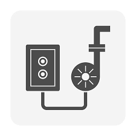
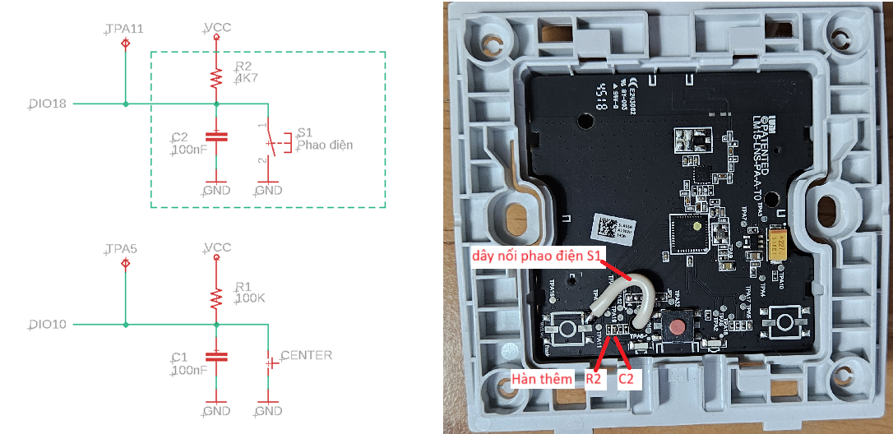
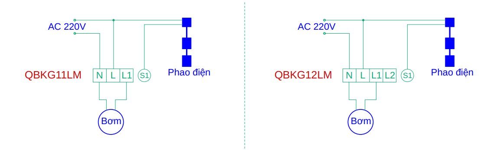

# 🚀 WPCZ1 - Water Pump Controller Zigbee 1
WPCZ1 là bản mod chuyển đổi các công tắc Zigbee có sẵn trên thị trường thành bộ điều khiển bơm nước (sử dụng phao điện) trong các hộ gia đình tại Việt Nam.

<div align="center">
  
</div>

Phiên bản đầu tiên này hỗ trợ các công tắc Xiaomi Aqara QBKG11LM (công tắc đơn) và QBKG12LM (công tắc đôi), có nối dây trung tính.

## ✨ Tính năng
- Điều khiển bơm nước bằng phao điện như truyền thống, đồng thời bổ sung khả năng bật / tắt bơm thủ công thông qua nút nhấn trên bộ điều khiển.
- Hỗ trợ điều khiển từ xa thông qua các ứng dụng nhà thông minh.
- Hiển thị các thông số như công suất, điện áp, dòng điện, số lần bật / tắt,... giúp dễ dàng giám sát hoạt động của bơm và phát hiện các bất thường (quá tải, quá nhiệt, rò rỉ nước gây bật / tắt liên tục,...).
- Tích hợp chức năng bảo vệ quá nhiệt (trên 55°C) và quá tải (trên 2000W).
- Điều khiển đóng / ngắt bơm tại điểm điện áp xấp xỉ 0V nhằm giảm hiện tượng tia lửa điện, giúp tăng tuổi thọ cho rơ le.

## 📸 Ảnh chụp màn hình


## ⚙️ Hướng dẫn
### 🛠 Thay đổi phần cứng
⚠️ **Cảnh báo an toàn**
- ⚠️ Phần thao tác này **chỉ nên được thực hiện bởi người có chuyên môn về điện - điện tử**. Việc lắp đặt hoặc sửa đổi sai cách có thể gây **nguy hiểm đến tính mạng**, cũng như **gây cháy nổ thiết bị.**
- ⚠️ **Không nên tự thực hiện nếu bạn không có chuyên môn** - hãy **nhờ kỹ thuật viên chuyên nghiệp** hoặc **sử dụng thiết bị đã được mod sẵn** để đảm bảo an toàn.

Xiaomi Aqara QBKG11LM và QBKG12LM dùng chung PCB (mã LM15-LNS-PA-A-T0), chỉ khác nhau số lượng nút nhấn và số rờ le bên trong.
- QBKG11LM: Có một nút nhấn điều khiển một rơ le ngõ ra.
- QBKG12LM: Được hàn thêm linh kiện để mở rộng thành hai nút nhấn, điều khiển hai rơ le ngõ ra.

✳️ WPCZ1 sử dụng **nút nhấn bên trái** để kết nối với **phao điện**, và **nút nhấn bên phải** để **bật / tắt bơm thủ công tại chỗ**.
- QBKG11LM:
  - Cần **hàn thêm điện trở R2 4K7 (SMD 0402)** và **tụ điện C2 100nF (SMD 0402).**
  - Hàn **dây kết nối phao điện** vào **nút nhấn S1 bên trái.**
  - Xem [hình ảnh chi tiết](doc/QBKG11LM_modify.md)
  
- QBKG12LM:
  - **Tháo bỏ nút nhấn bên trái** để dùng cho phao điện.
  - Nên **thay điện trở có sẵn R2 100K (SMD 0402)** bằng **4K7 (SMD 0402)** nhằm tăng độ nhạy cho phao điện đặt xa.
  - Hàn **dây kết nối phao điện** vào **nút nhấn S1 bên trái.**

### 🔌 Đấu nối dây điện


### 🧩 Tích hợp với Zigbee2MQTT
Khi vừa tham gia mạng, Zigbee2MQTT sẽ liệt kê **WPCZ1** là **thiết bị chưa được hỗ trợ**, và **không hiển thị bất kỳ tính năng nào.**

Để tích hợp WPCZ1 vào Zigbee2MQTT, thực hiện theo các bước sau:
- Sao chép file [wpcz1.js](z2m/wpcz1.js) vào thư mục: `zigbee2mqtt/data/external_converters`
- Thêm cấu hình sau vào tệp `configuration.yaml`:
```yaml
external_converters:
  - wpcz1.js
```
- Sau khi khởi động lại Zigbee2MQTT, **các tính năng của WPCZ1 sẽ được hiển thị và hỗ trợ đầy đủ.**

### 📦 Cập nhật firmware (OTA)
Firmware `WPCZ1.ota` hỗ trợ cập nhật qua OTA (Over-The-Air). Có thể dùng Zigbee2MQTT theo các bước sau:
- **Tải firmware** [WPCZ1.ota](ota/WPCZ1.ota) vào thư mục: `zigbee2mqtt/data` (cùng cấp với file `configuration.yaml`).
- **Khai báo OTA** bằng cách tạo hoặc sao chép / ghi đè file [my_index.json](z2m/my_index.json) vào thư mục: `zigbee2mqtt/data` với nội dung sau (cho QBKG11LM):
```json
[
    {
        "modelId": "lumi.ctrl_ln1.aq1",
        "url": "WPCZ1.ota",
        "force": true
    }
]
```
- Khai báo đường dẫn tới file `my_index.json` trong `configuration.yaml`:
```yaml
ota:
  zigbee_ota_override_index_location: my_index.json
```
- Thiết bị sẽ xuất hiện trong trang OTA của Zigbee2MQTT
  - Nhấp vào **"Check firmware update"** để kiểm tra bản cập nhật khả dụng.
  - Nhấn **"Update firmware"** để bắt đầu cập nhật.
- Hoàn tất cập nhật
  - **Xóa thiết bị** QBKG11LM (hoặc QBKG12LM) cũ khỏi Zigbee2MQTT (nhớ chọn **"Force remove"**).
  - **Khởi động lại Zigbee2MQTT**, đặt chế độ **"Permit join (All)".**
  - Khởi động lại WPCZ1, **thiết bị sẽ tự động tham gia mạng Zigbee** và hoạt động với **các tính năng mới** đã được cập nhật.

Xem [hình ảnh chi tiết](doc/QBKG11LM_Z2M.md)

**Lưu ý:**
- Thời gian cập nhật có thể mất **10 – 20 phút**.
- **Đặt thiết bị gần hub Zigbee** và đảm bảo **mạng ổn định** trong suốt quá trình cập nhật.

### 📖 Cách sử dụng WPCZ1
- **Điều khiển bơm nước tự động:** Bơm sẽ **tự động bật khi phao điện kích hoạt** (mực nước thấp) và **tự động tắt khi phao ngừng kích hoạt** (mực nước cao).
- **Điều khiển bơm thủ công:** Nhấn nút trên công tắc QBKG11LM (hoặc nút phải của QBKG12LM) để bật / tắt bơm thủ công.
- Khi mới cập nhật firmware `WPCZ1.ota` cho QBKG11LM (hoặc QBKG12LM), thiết bị sẽ **tự động dò tìm và tham gia mạng Zigbee**. Nếu cần kết nối thủ công, thực hiện như sau:
  - **Chưa kết nối mạng:** Nhấn giữ nút trên công tắc QBKG11LM (hoặc nút phải của QBKG12LM) **hơn 8 giây** để bắt đầu kết nối mạng Zigbee.
  - **Đã kết nối mạng, cần reset:** Nhấn **2 lần liên tiếp (double press)** rồi **nhấn giữ hơn 8 giây** nút tương ứng để **reset thiết bị và kết nối lại mạng.**

### 🚨 Trạng thái đèn LED
| Đèn báo                      | Trạng thái thiết bị                   |
|------------------------------|---------------------------------------|
| Đèn xanh sáng / tắt          | Bật / tắt bơm nước                    |
| Đèn xanh nhấp nháy liên tục  | Đang kết nối mạng                     |
| Đèn đỏ nhấp nháy ngắt quãng  | Thiết bị không được kết nối mạng      |
| Đèn đỏ nhấp nháy liên tục    | Báo động quá nhiệt                    |
| Đèn cam nhấp nháy liên tục   | Báo động quá tải                      |

## 🤝 Đóng góp
Chúng tôi hoan nghênh mọi đóng góp! Vui lòng gửi Pull Request nếu bạn muốn đóng góp cho dự án.

## 📄 Giấy phép
Dự án này được cấp phép theo Giấy phép MIT – xem tệp [LICENSE](LICENSE) để biết thêm chi tiết.

## 📞 Contact
Le Phuoc Thanh - lpthanh2@gmail.com

Project Link: [https://github.com/Leza1/WPCZ1](https://github.com/Leza1/WPCZ1)