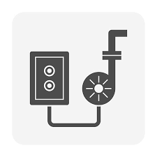
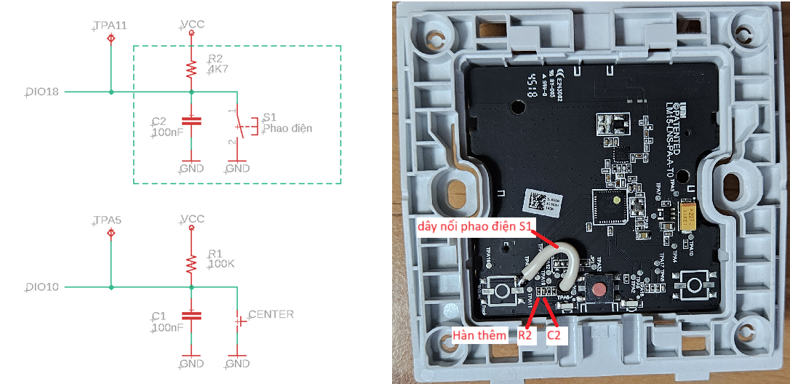
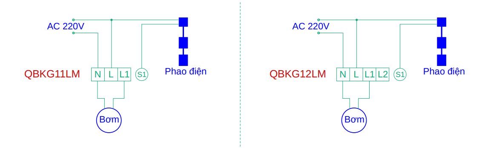

# 🚀 WPCZ1 - Water Pump Controller Zigbee 1
WPCZ1 là bản mod chuyển đổi các công tắc Zigbee có sẵn trên thị trường thành bộ điều khiển bơm nước (sử dụng phao điện) trong các hộ gia đình tại Việt Nam.

<div align="center">
  
</div>

Phiên bản đầu tiên này hỗ trợ các công tắc Xiaomi Aqara QBKG11LM (công tắc đơn) và QBKG12LM (công tắc đôi), có nối dây trung tính.

## ✨ Tính năng
- Điều khiển bơm nước bằng phao điện như truyền thống, đồng thời bổ sung khả năng bật / tắt bơm thủ công thông qua nút nhấn trên bộ điều khiển.
- Hỗ trợ điều khiển từ xa thông qua các ứng dụng nhà thông minh.
- Hiển thị các thông số như công suất, điện áp, dòng điện, số lần bật / tắt,... giúp dễ dàng giám sát hoạt động của bơm và phát hiện các bất thường (quá tải, quá nhiệt, rò rỉ nước gây bật / tắt liên tục,...).
- Tích hợp chức năng bảo vệ quá nhiệt (trên 55°C) và quá tải (trên 2000W).
- Điều khiển đóng / ngắt bơm tại điểm điện áp xấp xỉ 0V nhằm giảm hiện tượng tia lửa điện, giúp tăng tuổi thọ cho rơ le.

## 📸 Ảnh chụp màn hình


## ⚙️ Hướng dẫn
### 🛠 Thay đổi phần cứng
⚠️ **Cảnh báo an toàn**
- ⚠️ Phần thao tác này **chỉ nên được thực hiện bởi người có chuyên môn về điện hoặc điện tử**. Việc lắp đặt hoặc sửa đổi sai cách có thể gây **nguy hiểm đến tính mạng**, cũng như **gây cháy nổ thiết bị.**
- ⚠️ **Không nên tự thực hiện nếu bạn không có chuyên môn** - hãy **nhờ kỹ thuật viên chuyên nghiệp** hoặc **sử dụng thiết bị đã được mod sẵn** để đảm bảo an toàn.

Xiaomi Aqara QBKG11LM và QBKG12LM dùng chung PCB (mã LM15-LNS-PA-A-T0), chỉ khác nhau số lượng nút nhấn và rờ le bên trong.
- QBKG11LM: Có một nút nhấn điều khiển một rơ le ngõ ra.
- QBKG12LM: Được hàn thêm linh kiện để mở rộng thành hai nút nhấn, điều khiển hai rơ le ngõ ra.

✳️ WPCZ1 sử dụng **nút nhấn bên trái** để kết nối với **phao điện**, và **nút nhấn bên phải** để **bật / tắt bơm thủ công tại chỗ**.
- QBKG11LM:
  - Cần **hàn thêm điện trở R2 4K7 (SMD 0402)** và **tụ điện C2 100nF (SMD 0402).**
  - Hàn **dây kết nối phao điện** vào **nút nhấn S1 bên trái.**
  - Xem [hình ảnh chi tiết](QBKG11LM_modify.md)
  
- QBKG12LM:
  - **Tháo bỏ nút nhấn bên trái** để dùng cho phao điện.
  - Nên **thay điện trở có sẵn R2 100K (SMD 0402)** bằng **4K7 (SMD 0402)** nhằm tăng độ nhạy cho phao điện đặt xa.
  - Hàn **dây kết nối phao điện** vào **nút nhấn S1 bên trái.**

### 🔌 Đấu nối dây điện


### 🧩 Tích hợp với Zigbee2MQTT
Khi vừa tham gia mạng, Zigbee2MQTT sẽ liệt kê **WPCZ1** là **thiết bị chưa được hỗ trợ**, và **không hiển thị bất kỳ tính năng nào.**

Để tích hợp WPCZ1 vào Zigbee2MQTT, thực hiện theo các bước sau:
- Sao chép file [wpcz1.js](./z2m/wpcz1.js) vào thư mục: `zigbee2mqtt/data/external_converters`
- Thêm cấu hình sau vào tệp `configuration.yaml`:
```yaml
external_converters:
  - wpcz1.js
```
- Sau khi khởi động lại Zigbee2MQTT, **các tính năng của WPCZ1 sẽ được hiển thị và hỗ trợ đầy đủ.**

### 📦 Cập nhật firmware (OTA)
TODO:OTA

### 📖 Sử dụng

### 🚨 Trạng thái đèn LED
| Đèn báo                      | Trạng thái thiết bị                   |
|------------------------------|---------------------------------------|
| Đèn xanh sáng / tắt          | Bật / tắt bơm nước                    |
| Đèn xanh nhấp nháy liên tục  | Đang kết nối mạng                     |
| Đèn đỏ nhấp nháy ngắt quãng  | Thiết bị không được kết nối mạng      |
| Đèn đỏ nhấp nháy liên tục    | Báo động quá nhiệt                    |
| Đèn cam nhấp nháy liên tục   | Báo động quá tải                      |

## 📄 Giấy phép
Dự án này được cấp phép theo Giấy phép MIT – xem tệp [LICENSE](LICENSE) để biết thêm chi tiết.