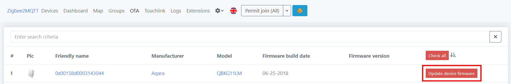
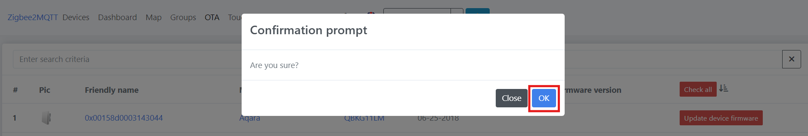
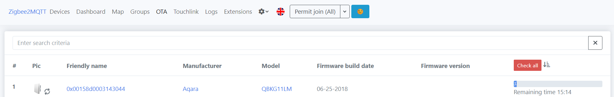
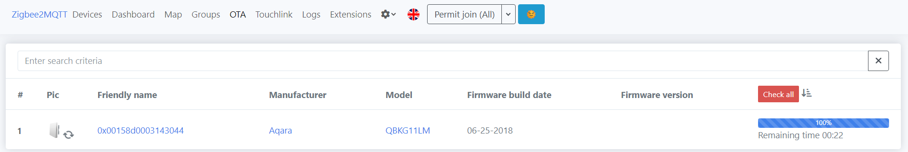
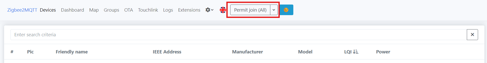
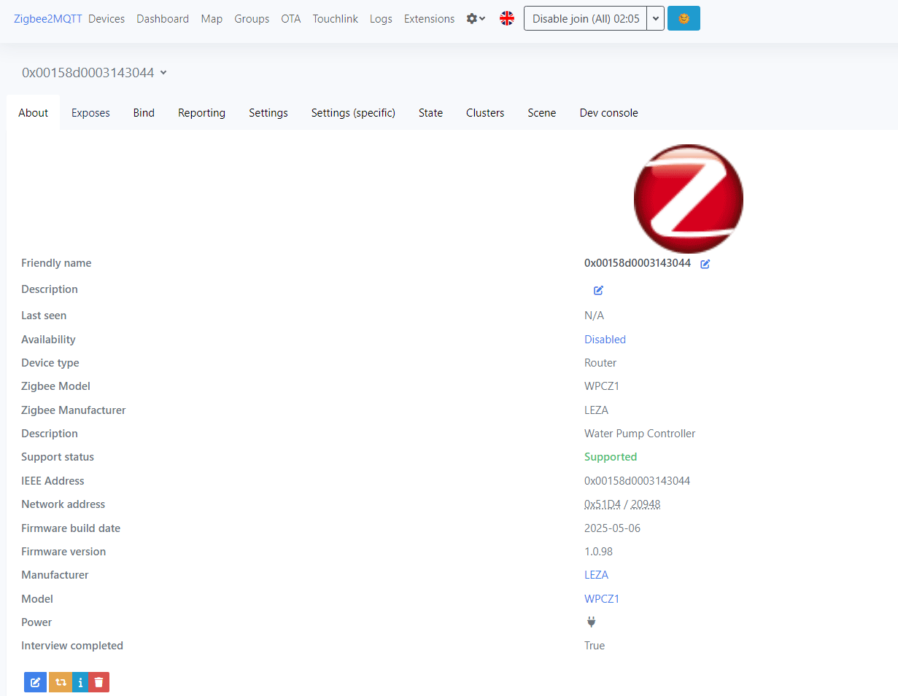
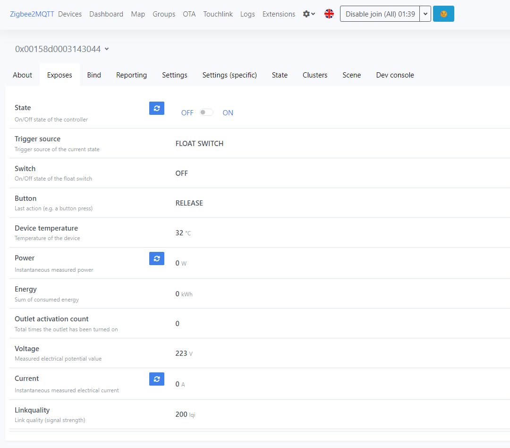
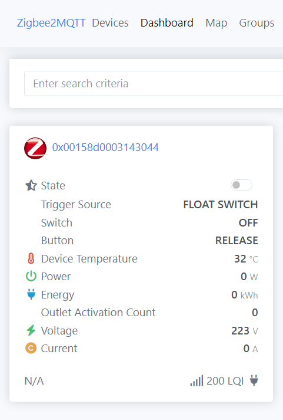

# Zigbee2MQTT: Cập nhật firmware WPCZ1.ota cho QBKG11LM

## Vào trang OTA, nhấp vào Check for new updates

## Update device firmware

## Xóa thiết bị QBKG11LM cũ

## Force remove

## Khởi động lại Zigbee2MQTT

## Permit join (All)

## WPCZ1

